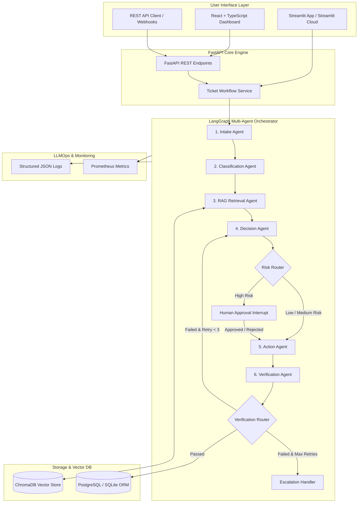

# AgentFlow — Multi-Agent Business Workflow Automation System

Subtitle: **An intelligent multi-agent platform for automating complex business processes using Python, LangGraph, FastAPI, ChromaDB, SQLAlchemy, React, and Streamlit.**

---

## 1. Project Overview

**AgentFlow** is an enterprise-grade AI/ML + GenAI + Agentic AI + LLMOps portfolio project designed to automate repetitive business processes and customer support ticket handling. Rather than a basic single-prompt chatbot, AgentFlow orchestrates a team of specialized agents through **LangGraph**, backed by **RAG (ChromaDB)**, **SQL DB (PostgreSQL / SQLite)**, **Human-in-the-Loop approval state machines**, real-time **LLMOps observability**, and dual dashboard interfaces (**React + TypeScript** and **Streamlit**).

---

## 2. Core Problem & Use Case

Businesses receive thousands of repetitive tickets daily (billing disputes, technical bugs, account issues, refund requests, documentation questions). Humans must manually read, classify, search docs, determine priority, assign teams, draft replies, request approvals, and log operations.

**AgentFlow automates this entire lifecycle end-to-end**:
1. **Receive & Normalize Ticket** (Intake Agent)
2. **Classify Category, Priority & Department** (Classification Agent)
3. **Retrieve Grounded Knowledge & Policies** (RAG Retrieval Agent)
4. **Evaluate Risk & Reason Action** (Decision Agent)
5. **Route High-Risk Requests to Humans** (LangGraph Interrupt / Human-in-the-Loop)
6. **Execute Action & Draft Citations** (Action Agent)
7. **Verify Safety & Groundedness** (Verification Agent)
8. **Update Database & Emit Structured Observability Logs** (PostgreSQL / Prometheus)

---

## 3. System Architecture & Diagram



---

## 4. Multi-Agent Architecture

| Agent | Responsibility | Output Schema |
|---|---|---|
| **Agent 1 — Intake Agent** | Text cleaning, customer ID extraction, field normalization | `ticket_id`, `customer_message`, `channel`, `metadata` |
| **Agent 2 — Classification Agent** | Categorization, priority, sentiment, complexity, target department | `category`, `priority`, `sentiment`, `department`, `confidence` |
| **Agent 3 — RAG Retrieval Agent** | Semantic similarity search against persistent ChromaDB | `documents`, `sources`, `retrieval_score`, `citations` |
| **Agent 4 — Decision Agent** | Reason action (`AUTO_REPLY`, `ASSIGN_TICKET`, `REQUEST_HUMAN_APPROVAL`, etc.) & risk evaluation | `decision`, `reason`, `risk_level`, `requires_approval` |
| **Agent 5 — Action Agent** | Draft customer response with RAG citations, notify Slack/Email, assign team | `action_type`, `customer_response`, `assigned_team`, `status` |
| **Agent 6 — Verification Agent** | Validate response against retrieved policy docs & safety rules | `approved`, `issues`, `confidence`, `explanation` |

---

## 5. Human-in-the-Loop Approval Workflow

High-risk operations (refund requests > $100, account security compromise, chargebacks) trigger a **LangGraph state machine interrupt**.

```text
Decision Agent (Risk: HIGH)
      ↓
Risk Router Edge
      ↓
Graph Interrupt (State set to PENDING_APPROVAL)
      ↓
API Endpoint / Dashboard Notification (GET /api/approvals/pending)
      ↓
Human Manager Approves / Rejects (POST /api/approvals/{id})
      ↓
Graph Resumes via Checkpointer -> Action Agent -> Verification -> Database
```

---

## 6. Streamlit Integration (`streamlit_app.py`)

AgentFlow features a complete **Streamlit Dashboard App** (`streamlit_app.py`) for rapid demonstration, interactive state inspection, and instant cloud deployment on **Streamlit Community Cloud**:
- **Submit Tickets & Run Workflows**: Interactive form to launch multi-agent graph execution.
- **Human Approval Queue**: Live review queue with **Approve** and **Reject** buttons to resume LangGraph state.
- **LangGraph Workflow Timeline**: Interactive state inspector displaying inputs, outputs, and retrieved citations for each agent node.
- **Agent Performance**: Charts and latency statistics across all 6 agents.
- **LLMOps Audit Logs**: Structured execution log viewer.

---

## 7. LLM Provider Abstraction

AgentFlow supports zero-lock-in LLM providers configured via environment variable `LLM_PROVIDER`:
- **`openai`**: Uses OpenAI API (`gpt-4o-mini` / `gpt-4o`) with structured JSON outputs.
- **`ollama`**: Uses local open-source models (`llama3` / `mistral`).
- **`mock`**: Includes a zero-dependency deterministic Mock provider enabling instant offline dry-runs and keyless automated testing.

---

## 8. Quickstart Commands

### Running Streamlit Dashboard App
```bash
cd agentic-workflow-automation
PYTHONPATH=backend backend/venv/bin/streamlit run streamlit_app.py
```
Open browser at `http://localhost:8501`.

---

### Running React Dashboard & FastAPI Backend

1. **Start Backend Server**:
   ```bash
   cd backend
   PYTHONPATH=. venv/bin/uvicorn app.main:app --reload --port 8000
   ```

2. **Start React Frontend**:
   ```bash
   cd frontend
   npm run dev
   ```
   Open browser at `http://localhost:3000`.

---

### Running Multi-Container Docker Setup
```bash
docker compose up --build
```

---

## 9. Automated Testing

Run the full pytest suite:

```bash
cd backend
PYTHONPATH=. venv/bin/pytest tests -v
```

---

## 10. License & Author

Built with Python, LangGraph, FastAPI, React, and Streamlit for production-grade Agentic Workflow Automation.
