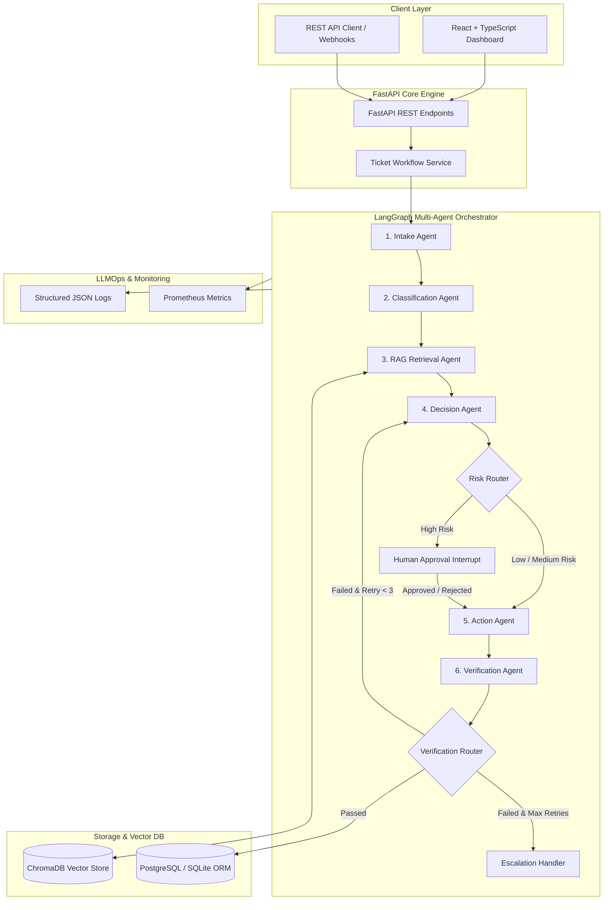

# AgentFlow — Multi-Agent Business Workflow Automation System

Subtitle: **An intelligent multi-agent platform for automating complex business processes using Python, LangGraph, FastAPI, ChromaDB, SQLAlchemy, and React.**

---

## 1. Project Overview

**AgentFlow** is an enterprise-grade AI/ML + GenAI + Agentic AI + LLMOps portfolio project designed to automate repetitive business processes and customer support ticket handling. Rather than a basic single-prompt chatbot, AgentFlow orchestrates a team of specialized agents through **LangGraph**, backed by **RAG (ChromaDB)**, **SQL DB (PostgreSQL / SQLite)**, **Human-in-the-Loop approval state machines**, and real-time **LLMOps observability**.

---

## 2. Core Problem & Use Case

Businesses receive thousands of repetitive tickets daily (billing disputes, technical bugs, account issues, refund requests, documentation questions). Humans must manually read, classify, search docs, determine priority, assign teams, draft replies, request approvals, and log operations.

**AgentFlow automates this entire lifecycle end-to-end**:
1. **Receive & Normalize Ticket** (Intake Agent)
2. **Classify Category, Priority & Department** (Classification Agent)
3. **Retrieve Grounded Knowledge & Policies** (RAG Retrieval Agent)
4. **Evaluate Risk & Reason Action** (Decision Agent)
5. **Route High-Risk Requests to Humans** (LangGraph Interrupt / Human-in-the-Loop)
6. **Execute Action & Draft Citations** (Action Agent)
7. **Verify Safety & Groundedness** (Verification Agent)
8. **Update Database & Emit Structured Observability Logs** (PostgreSQL / Prometheus)

---

## 3. System Architecture & Diagram



---

## 4. Multi-Agent Architecture

| Agent | Responsibility | Output Schema |
|---|---|---|
| **Agent 1 — Intake Agent** | Text cleaning, customer ID extraction, field normalization | `ticket_id`, `customer_message`, `channel`, `metadata` |
| **Agent 2 — Classification Agent** | Categorization, priority, sentiment, complexity, target department | `category`, `priority`, `sentiment`, `department`, `confidence` |
| **Agent 3 — RAG Retrieval Agent** | Semantic similarity search against persistent ChromaDB | `documents`, `sources`, `retrieval_score`, `citations` |
| **Agent 4 — Decision Agent** | Reason action (`AUTO_REPLY`, `ASSIGN_TICKET`, `REQUEST_HUMAN_APPROVAL`, etc.) & risk evaluation | `decision`, `reason`, `risk_level`, `requires_approval` |
| **Agent 5 — Action Agent** | Draft customer response with RAG citations, notify Slack/Email, assign team | `action_type`, `customer_response`, `assigned_team`, `status` |
| **Agent 6 — Verification Agent** | Validate response against retrieved policy docs & safety rules | `approved`, `issues`, `confidence`, `explanation` |

---

## 5. Human-in-the-Loop Approval Workflow

High-risk operations (refund requests > $100, account security compromise, chargebacks) trigger a **LangGraph state machine interrupt**.

```text
Decision Agent (Risk: HIGH)
      ↓
Risk Router Edge
      ↓
Graph Interrupt (State set to PENDING_APPROVAL)
      ↓
API Endpoint / Dashboard Notification (GET /api/approvals/pending)
      ↓
Human Manager Approves / Rejects (POST /api/approvals/{id})
      ↓
Graph Resumes via Checkpointer -> Action Agent -> Verification -> Database
```

---

## 6. LLM Provider Abstraction

AgentFlow supports zero-lock-in LLM providers configured via environment variable `LLM_PROVIDER`:
- **`openai`**: Uses OpenAI API (`gpt-4o-mini` / `gpt-4o`) with structured JSON outputs.
- **`ollama`**: Uses local open-source models (`llama3` / `mistral`).
- **`mock`**: Includes a zero-dependency deterministic Mock provider enabling instant offline dry-runs and keyless automated testing.

---

## 7. Demo Scenarios

### Scenario 1 — Simple FAQ (Auto-Resolved)
- **Customer Query**: *"Where can I find API documentation and API keys?"*
- **Execution**: `Intake -> Classify (General Question, Low Priority) -> RAG (faq.md) -> Decision (AUTO_REPLY, LOW Risk) -> Action (Draft Reply + Citation) -> Verification (Passed) -> RESOLVED`

### Scenario 2 — Complex Technical Problem (Department Assignment)
- **Customer Query**: *"HTTP 500 error when exporting 50,000 analytics records via REST API."*
- **Execution**: `Intake -> Classify (Technical Issue, Medium Priority, Technical Support) -> RAG (troubleshooting.md) -> Decision (ASSIGN_TICKET, MEDIUM Risk) -> Action (Assign Technical Support) -> Verification (Passed) -> IN_PROGRESS`

### Scenario 3 — High-Risk Financial Dispute (Human Approval)
- **Customer Query**: *"My payment failed three times during checkout, but $149.00 was deducted from my bank account."*
- **Execution**: `Intake -> Classify (Refund / Billing, Urgent) -> RAG (refund_policy.md) -> Decision (REQUEST_HUMAN_APPROVAL, HIGH Risk) -> LangGraph Interrupt (PENDING_APPROVAL) -> Human Manager Clicks Approve on Dashboard -> Resumes Action & Verification -> RESOLVED`

---

## 8. API Documentation

### Tickets API
- `POST /api/tickets`: Create a new support ticket.
- `GET /api/tickets`: List all tickets.
- `GET /api/tickets/{ticket_id}`: Retrieve ticket details.

### Workflows API
- `POST /api/workflows/run`: Trigger multi-agent LangGraph workflow execution.
- `GET /api/workflows`: List workflow execution runs.
- `GET /api/workflows/{run_id}`: Inspect workflow run state data.

### Approvals API
- `GET /api/approvals/pending`: Fetch pending human-in-the-loop approval requests.
- `POST /api/approvals/{approval_id}`: Submit human decision (`approved: true/false`).

### Agents & Logs API
- `GET /api/agents`: Retrieve performance metrics summary for all 6 agents.
- `GET /api/runs/{run_id}/logs`: Retrieve structured node execution logs for a workflow.
- `GET /api/logs`: Audit log stream.

---

## 9. Quickstart & Installation

### Option 1 — Local Development with Python 3.11 & Node.js

1. **Clone repository & prepare directory**:
   ```bash
   cd agentic-workflow-automation
   ```

2. **Backend Setup**:
   ```bash
   cd backend
   python3 -m venv venv
   source venv/bin/activate
   pip install -r requirements.txt greenlet
   ```

3. **Ingest Knowledge Base & Seed Data**:
   ```bash
   python ../scripts/ingest_documents.py
   python ../scripts/seed_database.py
   ```

4. **Run Backend Server**:
   ```bash
   uvicorn app.main:app --reload --port 8000
   ```

5. **Frontend Setup**:
   ```bash
   cd ../frontend
   npm install
   npm run dev
   ```
   Open `http://localhost:3000` in browser.

---

### Option 2 — Multi-Container Docker Deployment

Start backend, frontend, PostgreSQL, and ChromaDB using Docker Compose:

```bash
docker compose up --build
```
- **Frontend Dashboard**: `http://localhost:3000`
- **FastAPI REST API Docs**: `http://localhost:8000/docs`

---

## 10. Automated Testing

Run the full pytest suite (Unit, API, LangGraph routers, and E2E Integration tests):

```bash
cd backend
PYTHONPATH=. venv/bin/pytest tests -v
```

---

## 11. Project Structure

```text
agentic-workflow-automation/
├── backend/
│   ├── app/
│   │   ├── api/          # FastAPI REST endpoints
│   │   ├── agents/       # 6 Specialized AI Agents
│   │   ├── graph/        # LangGraph StateGraph & Routers
│   │   ├── rag/          # ChromaDB RAG Ingestion & Retriever
│   │   ├── llm/          # OpenAI, Ollama & Mock Providers
│   │   ├── database/     # SQLAlchemy ORM Models & Repositories
│   │   ├── integrations/ # Slack & Email Integration Adapters
│   │   ├── monitoring/   # Structured Logger & Prometheus Metrics
│   │   ├── schemas/      # Pydantic v2 Models
│   │   ├── services/     # Ticket Workflow Service Logic
│   │   ├── main.py       # FastAPI Entrypoint
│   │   └── config.py     # Pydantic Settings
│   ├── tests/            # Pytest Unit, API & E2E Suites
│   ├── requirements.txt
│   └── Dockerfile
├── frontend/             # React + TypeScript + Tailwind Dashboard
│   ├── src/
│   │   ├── components/   # Timeline, StatusBadge, Navbar, Sidebar
│   │   ├── pages/        # Overview, Tickets, Approvals, Agents, Logs
│   │   ├── services/     # API Client
│   │   └── types/        # TypeScript Interfaces
│   ├── package.json
│   └── Dockerfile
├── knowledge_base/       # Policy & Troubleshooting Markdown Docs
├── scripts/              # Ingestion & Seed Scripts
├── docker-compose.yml
├── .env.example
└── README.md
```

---

## 12. License & Author

Built with Python, LangGraph, FastAPI, and React for production-grade Agentic Workflow Automation.
